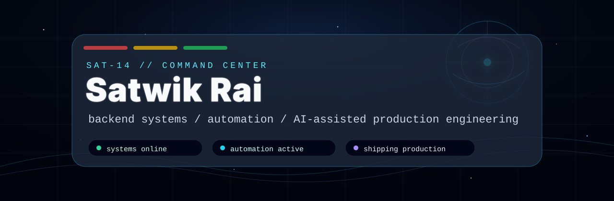
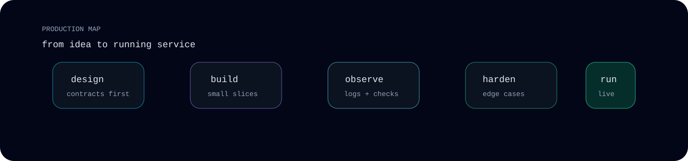

<div align="center">
  
</div>

<p align="center">
  <a href="https://discord.com/users/982740402509598770"></a>
  <a href="https://t.me/Stwzxs"></a>
  <a href="mailto:pulakrai10@gmail.com"></a>
</p>

```txt
boot: sat-14
mode: backend-first / automation-heavy / ai-assisted
rule: useful systems first, impressive surfaces second
```

I build production software around APIs, workers, payment flows, Steam automation, admin tooling, deployment pipelines, and AI-assisted engineering workflows. I like systems that can be observed, restarted, audited, and improved without guessing.

<div align="center">
  
</div>

## What I Actually Build

<table>
  <tr>
    <td width="50%">
      <h3>Current Flagship</h3>
      <strong>tf2cart</strong><br />
      Automated TF2 key trading infrastructure with crypto payments, Steam bot operations, liquidity controls, admin service management, SEO pages, and VPS deployment.
    </td>
    <td width="50%">
      <h3>Operating Style</h3>
      Ship small, inspect logs, lock the edge cases, automate the repeat work, and make every production issue leave the system stronger than before.
    </td>
  </tr>
</table>

<div align="center">
  
</div>

## Signal

<table>
  <tr>
    <td width="33%" align="center">
      <strong>systems</strong><br />
      APIs, auth, queues, databases, workers, service controls
    </td>
    <td width="33%" align="center">
      <strong>automation</strong><br />
      bots, monitors, deployment scripts, recovery workflows
    </td>
    <td width="33%" align="center">
      <strong>AI workflows</strong><br />
      LLM-assisted building, ML experiments, practical tooling
    </td>
  </tr>
</table>

```bash
$ current_focus
crypto payment automation
steam trading infrastructure
admin dashboards that operators can trust
ai-assisted production velocity
```

## Field Notes

```txt
if a service can fail:
  make the failure visible
  make recovery boring
  make the next deploy safer

if a workflow repeats:
  automate it
  document the sharp edges
  add a check before humans forget
```

<details>
  <summary><strong>open the black box</strong></summary>
  <br />
  <table>
    <tr>
      <td><code>payments</code></td>
      <td>invoice flows, exact amount detection, refunds, swaps, wallet operations</td>
    </tr>
    <tr>
      <td><code>steam</code></td>
      <td>trade offers, inventory checks, bot sessions, stock reservations</td>
    </tr>
    <tr>
      <td><code>admin</code></td>
      <td>service controls, live stats, logs, operational actions, safety guards</td>
    </tr>
    <tr>
      <td><code>deploy</code></td>
      <td>VPS workflows, frontend builds, Caddy, systemd, health checks</td>
    </tr>
  </table>
</details>

## Stack I Reach For

<p>
  <code>Python</code>
  <code>FastAPI</code>
  <code>PostgreSQL</code>
  <code>Redis</code>
  <code>JavaScript</code>
  <code>React</code>
  <code>Node.js</code>
  <code>Docker</code>
  <code>Linux</code>
  <code>GitHub Actions</code>
  <code>PyTorch</code>
  <code>TensorFlow</code>
</p>

<details>
  <summary><strong>more telemetry</strong></summary>
  <br />
  <table>
    <tr>
      <td><code>primary lane</code></td>
      <td>backend + automation + production operations</td>
    </tr>
    <tr>
      <td><code>favorite problems</code></td>
      <td>payments, bots, queues, monitoring, admin tooling, recovery flows</td>
    </tr>
    <tr>
      <td><code>default question</code></td>
      <td>what fails at 3 AM, and how do we make it visible?</td>
    </tr>
  </table>
</details>

---

<p align="center">
  <code>systems over noise</code>
  &nbsp;&nbsp;|&nbsp;&nbsp;
  <code>automation over repetition</code>
  &nbsp;&nbsp;|&nbsp;&nbsp;
  <code>shipping over polishing forever</code>
</p>
